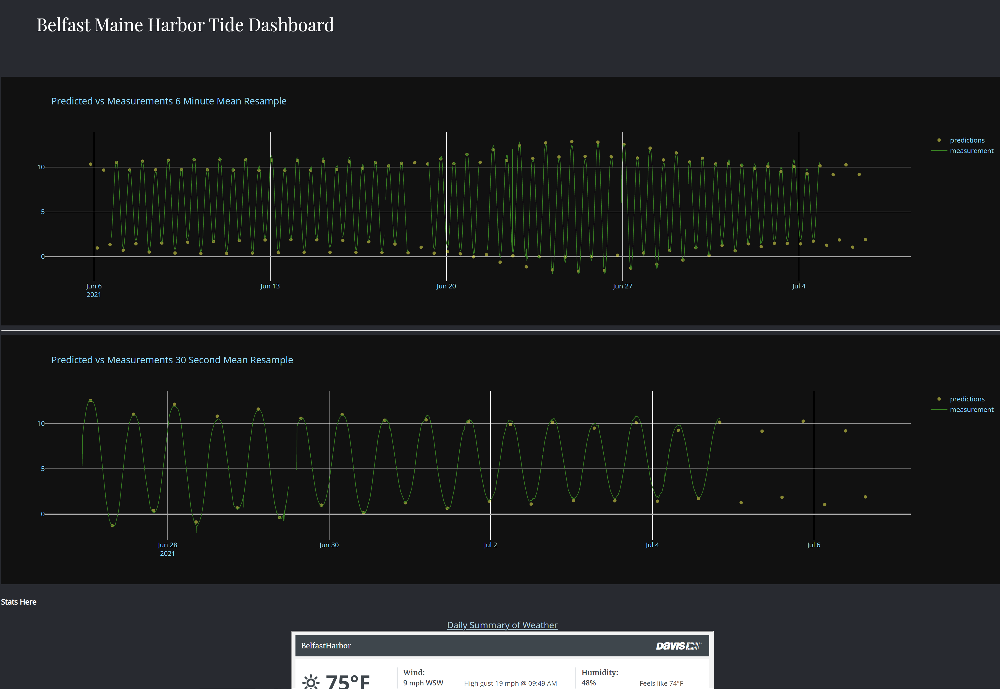

# Tide Monitor Dashboard

This is a dashboard for monitoring the tide height and weather data at the City Dock in Belfast, Maine.

Dash abstracts away all of the technologies and protocols required to build an interactive web-based application and is a simple and effective way to bind a user interface around your Python code. To learn more check out our [documentation](https://plot.ly/dash).

Try out the app [here](http://belfastmaineharbor.pythonanywhere.com/).




## Overview

This initial version fetches data form a csv file but the full version will access the real-time tide height and weather data.

The plotly graphs are interactive so you can zoom and pan in them and hover over traces to see data points.

### Try it out

First create a virtual environment, if desired, with conda or venv inside a folder, then activate it.

Clone the git repo, then install the requirements with pip
```
git clone https://github.com/DaveSprague/tide-monitor-dashboard.git
cd tide-monitor-dashboard
pip install -r requirements.txt
```

Run the app
```
python app.py
```

## Development
### ToDo:
 * Document project hardware
 * Document and publish project arduino and raspberry pi software
 * Support display of live sensor values
 * Integrate weather data from our Davis Weather station
 * Write and publish article on project
 * Plan/Develop a long term data archive process for the data
 * Simplify the Arduino/RPi data upload hardware using a single ESP32 Lora Board
 * Add a dashboard display at the harbor master office and at Belfast Area High School

## Built With
* [Dash](https://dash.plot.ly/) - Main server and interactive components
* [Plotly Python](https://plot.ly/python/) - Used to create the interactive plots
* [Pandas](https://pandas.pydata.org/) - Used to filter and resample data.
* Arduino compatible hardware and software
* Raspberry Pi for uploading data

## Built By:
 * Belfast Area High School Projects In Engineering class 2020/2021
 * David Thomas, teacher
 * David Sprague, volunteer instructor
 * Don Blair, project advisor
